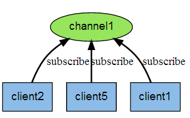
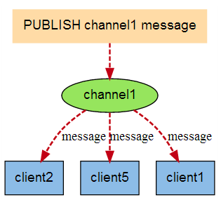

redis> SET mykey "10"
"OK"
redis> INCR mykey
(integer) 11
redis> GET mykey
"11"
redis> 

# 对不存在的 key 值进行 DECR

redis> EXISTS count
(integer) 0

redis> DECR count
(integer) -1

Redis 发布订阅
Redis 发布订阅 (pub/sub) 是一种消息通信模式：发送者 (pub) 发送消息，订阅者 (sub) 接收消息。

Redis 客户端可以订阅任意数量的频道。

下图展示了频道 channel1 ， 以及订阅这个频道的三个客户端 —— client2 、 client5 和 client1 之间的关系：

当有新消息通过 PUBLISH 命令发送给频道 channel1 时， 这个消息就会被发送给订阅它的三个客户端：

实例
以下实例演示了发布订阅是如何工作的，需要开启两个 redis-cli 客户端。

在我们实例中我们创建了订阅频道名为 runoobChat:

第一个 redis-cli 客户端
redis 127.0.0.1:6379> SUBSCRIBE runoobChat

Reading messages... (press Ctrl-C to quit)
1) "subscribe"
2) "runoobChat"
3) (integer) 1
   现在，我们先重新开启个 redis 客户端，然后在同一个频道 runoobChat 发布两次消息，订阅者就能接收到消息。

第二个 redis-cli 客户端
redis 127.0.0.1:6379> PUBLISH runoobChat "Redis PUBLISH test"

(integer) 1

redis 127.0.0.1:6379> PUBLISH runoobChat "Learn redis by runoob.com"

(integer) 1

# 订阅者的客户端会显示如下消息
1) "message"
2) "runoobChat"
3) "Redis PUBLISH test"
1) "message"
2) "runoobChat"
3) "Learn redis by runoob.com"
   gif 演示如下：

开启本地 Redis 服务，开启两个 redis-cli 客户端。

在第一个 redis-cli 客户端输入 SUBSCRIBE runoobChat，意思是订阅 runoobChat 频道。

在第二个 redis-cli 客户端输入 PUBLISH runoobChat "Redis PUBLISH test" 往 runoobChat 频道发送消息，这个时候在第一个 redis-cli 客户端就会看到由第二个 redis-cli 客户端发送的测试消息。
